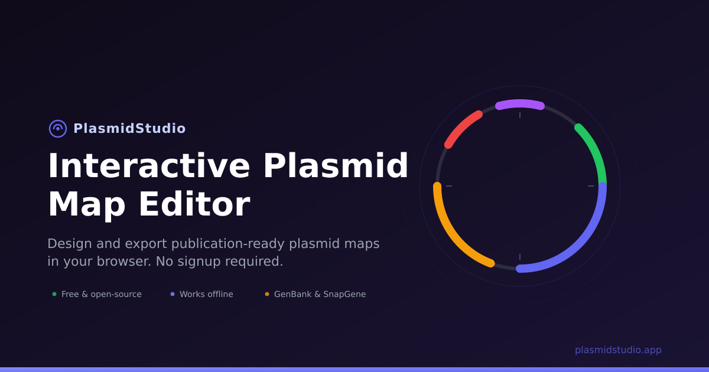

# PlasmidStudio

A browser-based plasmid map editor for molecular biology. Build, annotate, and export publication-ready circular and linear plasmid maps - no signup, no server, no dependencies.

**[plasmidstudio.app](https://plasmidstudio.app)**



## Features

- **Circular & linear views** - toggle between layouts, both fully interactive
- **Multi-track rings** - organize features across inner and outer tracks
- **Import formats** - GenBank (.gb/.gbk), FASTA (.fa/.fasta), SnapGene (.dna), JSON
- **NCBI & AddGene fetch** - import by accession number or AddGene ID
- **Export** - SVG, PNG (configurable resolution), PDF, GenBank, JSON
- **GC content track** - sliding-window GC% plot inside the backbone
- **Restriction enzyme analysis** - 100 built-in enzymes (Type II + Type IIS) with overhang visualization
- **Inline editing** - click any feature to edit name, color, position, label style, borders
- **Multi-tab workspace** - up to 10 plasmids open simultaneously
- **Undo/redo** - 50-level undo history
- **Share via URL** - compressed shareable links encoding the full map state
- **Dark mode** - automatic or manual theme switching
- **Keyboard shortcuts** - navigation, selection, undo/redo, export
- **Works offline** - installable as a PWA, all data stays in localStorage
- **Markers** - add labeled position markers with customizable styles

## Quick Start

PlasmidStudio is a static site - three core files (`app.html`, `plasmid.js`, `plasmid.css`) plus fonts. No build step, no package manager.

**Run locally:**

```bash
# Any static file server works
python3 -m http.server 8080
# Open http://localhost:8080/app.html
```

**Or just open `app.html` directly in a browser** - everything works from `file://` except NCBI/AddGene fetch (which requires CORS).

## Project Structure

```
app.html           Main application page
plasmid.js         All application logic (~9100 lines, single IIFE)
plasmid.css        All styles (~1900 lines)
index.html         Landing page
landing.css        Landing page styles
sw.js              Service worker for offline/PWA support
manifest.json      PWA manifest
offline.html       Offline / network-error fallback
impressum.html     Legal notice
datenschutz.html   Privacy policy
robots.txt         Crawler rules
sitemap.xml        Sitemap
fonts/             Self-hosted Inter (latin + latin-ext)
icons/             PWA & favicon icons (SVG + PNG)
examples/          Example plasmid maps
```

## File Formats

### Import

| Format | Extensions | Notes |
|--------|-----------|-------|
| GenBank | `.gb`, `.gbk` | Features, sequence, metadata. Multi-record files use first record. |
| FASTA | `.fa`, `.fasta` | Sequence only, no features. |
| SnapGene | `.dna` | Binary format. Features, sequence, topology. |
| JSON | `.json` | PlasmidStudio's native format. Full state including styling. |

### Export

| Format | Notes |
|--------|-------|
| SVG | Vector, transparent background |
| PNG | Raster, configurable resolution and background |
| PDF | Vector via jsPDF |
| GenBank | Standard `.gb` with features and sequence |
| JSON | Full project state, re-importable |

## Coordinates

PlasmidStudio uses **1-based inclusive** coordinates, matching the convention used by Geneious, SnapGene, and GenBank. A feature at positions 100–200 spans 101 base pairs.

## Browser Support

Works in all modern browsers (Chrome, Firefox, Safari, Edge). No IE support. Requires ES2020+ features (optional chaining, nullish coalescing).

## License

MIT - free for any use. All generated figures may be used freely in publications, presentations, theses, and commercial work.

## Author

Christopher Acatay
